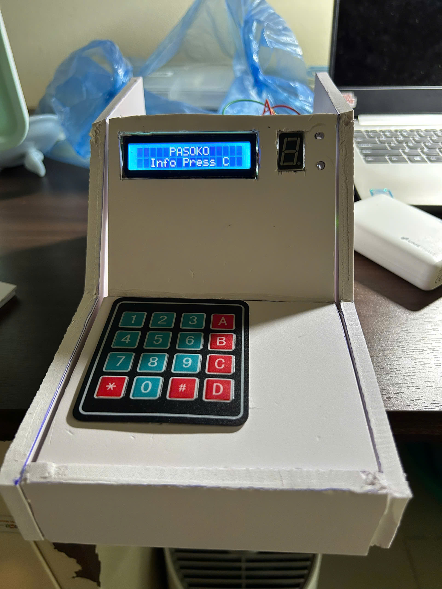

## 🎮 Features

This system includes **two embedded mini-games** built on top of the PASOKO ENGINE UI framework:

---

## 🧠 1. MATH MASTER

A fast-paced arithmetic challenge game that tests both speed and accuracy.

### 🎯 Game Modes

- **Test Mode**
  - 10 fixed questions per session
- **Endless Mode**
  - Continue until the player answers incorrectly

### ⚙️ Difficulty Levels

- Easy
- Medium
- Hard

---

### ⏱️ Gameplay Mechanics

- Timer decreases per question (increasing pressure over time)
- Player answers using 4x4 keypad input
- Real-time feedback using LEDs:
  - 🟢 Green LED → Correct answer
  - 🔴 Red LED → Wrong answer

---

### 📊 End of Session Stats

After completing a session, the system displays:

- Total score
- Average time per question
- Performance summary

---

## 🧠 2. NUMBER MEMORY

A progressive memory training game focused on short-term recall.

### 🎯 Core Loop

1. System displays a random number on LCD
2. Timer starts
3. Number disappears after a short duration
4. Player must re-enter the number using keypad

---

### 📈 Difficulty Progression

- Number length increases as the player progresses
- Display time gradually decreases
- Challenge scales dynamically based on performance

---

### 🧩 Objective

Train and test:

- Short-term memory
- Focus under time pressure
- Input accuracy via keypad

---

## ⚡ System Behavior

Both games are managed by a **custom screen rendering engine (PASOKO ENGINE)**:

- Only redraws LCD when screen state changes
- Prevents flickering and unnecessary updates
- Mimics a lightweight UI framework similar to Flutter’s `setState`

---

## 🖼️ Example Output

Here is an example of the system in action:

